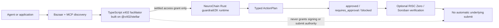

# SCF x402 Facilitator + Bazaar RFP Gap Analysis

Date: 2026-08-20

Repository baseline: `763f656` (`codex/mcp-skills-simplification`)

Readiness branch: `codex/scf-x402-bazaar-readiness`

## Scope And Sources

This document maps the current NeuroChain DSL for Stellar implementation to
the active SCF RFP **X402 Facilitator with Bazaar (discovery) support**. It is
a readiness analysis, not an architecture approval or a production-readiness
claim.

Primary requirements source:

- SCF handbook RFP source at
  `stellar/scf-handbook@0d5dbc126915ff7c3cff1aa8c32c025524774c56`
- RFP section: `scf-awards/build-award/rfp-track.md`, lines 97-203 at the
  pinned revision
- URL:
  <https://github.com/stellar/scf-handbook/blob/0d5dbc126915ff7c3cff1aa8c32c025524774c56/scf-awards/build-award/rfp-track.md#x402-facilitator-with-bazaar-discovery-support>

Observed dependency baseline on 2026-08-20:

- `@x402/stellar` latest registry version: `2.23.0`
- package license: `Apache-2.0`
- x402 repository main revision observed:
  `75b519d0a3a7fd609a00b6d5bf684a6a9131fe25`

No npm dependency is added by this analysis. The package version and x402 spec
revision must be selected and pinned only after the module boundary is
approved.

## Approved Offline Module Boundary

The first post-analysis milestone now locks a versioned, offline data contract
between the future TypeScript `@x402/stellar` facilitator/Bazaar service and
the Rust NeuroChain guardrail/ZK runtime. See
`docs/x402_service_boundary.md`, `src/x402_service_boundary.rs`, and
`examples/x402_service_boundary/`.

This approval covers types, fixtures, validation, and authority invariants
only. It does not approve a Node.js runtime, npm dependency, HTTP endpoint,
credential, settlement, pubnet operation, deployment, wallet signing, or
ActionPlan submission.

## Status Vocabulary

| Status | Meaning |
| --- | --- |
| `existing` | Implemented in the repository with local evidence matching the stated scope. |
| `partial` | Useful foundation exists, but it does not satisfy the complete RFP requirement. |
| `missing` | No matching implementation was found. |
| `decision needed` | Implementation must wait for an explicit product, architecture, trust-model, or operating decision. |

## Executive Result

NeuroChain is a credible starting foundation, but it is not the RFP
deliverable yet.

- The repository already has typed Stellar ActionPlans, deterministic
  guardrails, x402 v2 payment envelopes, authenticated `/supported` and
  read-only `/verify` transport evidence, a guarded offline `/settle`
  transport, persistent replay/idempotency state, bounded audit events, MCP v0
  no-submit tools, and RISC Zero/Groth16/Soroban evidence.
- The server remains verify-only. It does not expose a production facilitator,
  does not runtime-dispatch settlement, and has no valid signed live payment or
  pubnet settlement evidence.
- The repository has no Bazaar catalog, discovery endpoints, automatic
  cataloging, natural-language ranking, MCP discovery server, paid-call proxy,
  seller/buyer discovery SDK, or Stellar `upto` implementation.
- The current Rust transport does not use `@x402/stellar`. The RFP explicitly
  requires building on that package rather than reimplementing verify and
  settle.
- Payment, proof, guardrail approval, signing, settlement, and underlying
  ActionPlan submission must remain separate authority domains.

Current headline assessment:

| Area | Assessment |
| --- | --- |
| Existing NeuroChain guardrail/ZK foundation | `existing` |
| RFP facilitator foundation | `partial` |
| RFP Bazaar discovery layer | `missing` |
| RFP MCP discovery and paid-call interface | `missing` |
| RFP `upto` scheme and upstream contribution | `missing` |
| Production operations, conformance, audit, and maintenance | `missing` / `decision needed` |

## Verified NeuroChain Foundation

| Capability | Status | Repository evidence | Bounded claim |
| --- | --- | --- | --- |
| Typed ActionPlan and deterministic guardrails | `existing` | `src/intent_stellar.rs`, `src/mcp_v0_runtime.rs`, CLI/REPL/script/API tests | Produces `approved`, `requires_approval`, or `blocked`; no automatic submit. |
| x402 paid-ingress response contract | `existing` | `src/x402_stellar.rs`, `examples/x402_response_contract/` | Payment state wraps the same guardrail pipeline and does not grant submit authority. |
| x402 v2 runtime challenge and signature envelope | `existing` | `src/x402_facilitator.rs`, `docs/x402_facilitator_phase3.md` | Emits `PAYMENT-REQUIRED` and accepts bounded `PAYMENT-SIGNATURE` input in facilitator mode. |
| `/supported` capability handshake | `partial` | `X402FacilitatorConfig::validate_supported`, `examples/x402_facilitator_adapter/supported_stellar_exact_v2.json` | Models x402 v2 exact on both Stellar CAIP-2 network identifiers; not a hosted RFP endpoint. |
| Authenticated `/verify` transport | `partial` | `ReqwestX402FacilitatorTransport`, approved live rejection evidence in `docs/x402_facilitator_phase3.md` | Live test proved authentication, wire mapping, parser, and fail-closed rejection only; no valid signed payment. |
| Guarded `/settle` transport | `partial` | `settle_after_verified_request`, `src/x402_store.rs` | Offline-tested and state-gated; not connected to the server runtime and never exercised with a live payment. |
| Persistent replay/idempotency state | `existing` for the current single-process boundary | `FileX402ChallengeStore`, settlement state tests | Exact verify binding, single-attempt dispatch, terminal rejection, uncertain-outcome recovery; not a multi-instance production store. |
| Bounded audit events | `existing` | `src/x402_audit.rs` | Stores public state evidence without credentials, signatures, or raw payment payloads. |
| MCP v0 guardrail surface | `existing` | `src/mcp_v0_runtime.rs`, `tests/mcp_v0_contract.rs`, `docs/mcp_skill_completion_audit.md` | Five read-only/no-submit tools; not the RFP discovery MCP server. |
| NeuroChain Stellar Guardrails skill | `existing` as a release candidate | `skills/neurochain-stellar-guardrails/` | Internal release candidate, not externally published and not a runtime dependency. |
| RISC Zero/Groth16/Soroban proof flow | `existing` | `hackathons/stellar-real-world-zk/`, `deployments/testnet.json` | Private-policy binding and three decision states verified; proof is not payment or submit permission. |
| Permissive project license | `existing` | root `LICENSE`, `Cargo.toml` | Apache-2.0 for the current repository; future dependency closure still needs a license audit. |

## General RFP Track Requirements

The SCF RFP Track also defines proposal-wide requirements outside the x402
RFP's numbered sections.

| General requirement | Status | Current evidence | Gap / acceptance evidence still needed |
| --- | --- | --- | --- |
| Address an active RFP directly | `existing` | SCF Interest Form names `X402 Facilitator with Bazaar (discovery) support`; this matrix follows its numbered requirements. | Keep the full proposal scope and milestone language tied to the live RFP revision. Explain any intentionally limited scope. |
| Show relevant developer-tooling experience and open-source work | `partial` | Public NeuroChain repository, x402 transport, MCP package, Soroban/ZK work, docs, tests, and hosted demo. | Curate concise evidence links and explain which existing components reduce delivery risk without calling them the finished facilitator. |
| Clear, testable milestones | `partial` | This analysis proposes an ordered milestone sequence and concrete evidence gates. | Approve scope, dates, tranche boundaries, owners, budget, and acceptance criteria in the full submission. |
| Maintenance after launch | `missing` | Current repository has release gates and project-memory discipline. | State funded and post-grant maintenance term, update SLA, security patch policy, support channel, sustainability, and handoff option. |
| High-level diagram and plain-English stack explanation | `partial` | Candidate boundary diagram appears below; existing ZK architecture docs cover a narrower component. | Approve the actual service boundary and produce final facilitator/Bazaar deployment and data-flow diagrams for the proposal. |
| Explain decentralization or justify centralization | `decision needed` | RFP requires self-hostability and off-chain indexing by default; no operator/federation design exists. | Define fork/self-host path, catalog federation/interoperability, control points, and why any hosted coordination remains necessary. |
| Explain infrastructure | `decision needed` | Current OCI host runs the bounded NeuroChain demo only and is not sized or approved for the RFP service. | Select environments, data stores, network topology, secrets boundary, backups, scaling, regions, SLOs, and cost model. |
| Explain user tracking and user protection | `decision needed` | Current audit events intentionally omit credentials and signed payment material. | Define minimal telemetry, privacy/retention/deletion policy, abuse prevention, PII boundaries, consent/disclosure, and access controls. |
| Regular community updates | `missing` | Public repositories and website exist; no RFP update cadence is committed. | Choose update channel and cadence, publish milestones/conformance status, and define incident/security communication. |
| Use the most recent stable Stellar stack | `decision needed` | Existing Rust and Soroban components are pinned independently; observed `@x402/stellar` is not installed. | At implementation start, record and pin stable Stellar SDK/RPC, Soroban, x402 spec, and package versions; define upgrade/conformance policy. |
| Build in the open under a compatible license | `partial` | Current code is Apache-2.0 and public. | Confirm the new service license, dependency closure, contribution process, public roadmap, and release artifacts. |

## 3.1 Facilitator Requirements

| RFP requirement | Status | Current evidence | Gap / acceptance evidence still needed |
| --- | --- | --- | --- |
| Build on `@x402/stellar`; do not reimplement verify/settle | `missing` | Current implementation is Rust and the repository has no `package.json` or npm dependency. | Approve a TypeScript package/service boundary, pin `@x402/stellar`, and prove calls use its canonical APIs. Preserve Rust only as the NeuroChain guardrail/ZK service boundary. |
| Production facilitator on `stellar:testnet` and `stellar:pubnet` | `partial` | Rust config accepts both identifiers; approved live probes covered testnet `/supported` and rejected `/verify`. | Hosted and self-hosted service, valid exact payment E2E, and settled transaction hashes on both networks. Pubnet activity requires separate user approval. |
| Expose `supported`, `verify`, and `settle` | `partial` | Current Rust code is an outbound client transport for all three operations. Server runtime exposes paid intent ingress but stops after verify. | Implement the canonical facilitator server surface using `@x402/stellar`; wire-level tests with stock clients. |
| Strict Soroban auth-entry validation; classic keypairs and custom `__check_auth` | `missing` | Current transport delegates verification to an external facilitator and does not implement the canonical auth-entry verifier. | Use official package behavior, add positive/negative fixtures, expiry/replay/tamper cases, classic and custom-account E2E. |
| Any SEP-41 token, USDC default, seven-decimal handling | `partial` | Config validates a C-address asset and positive base-unit amount. | Token metadata/decimal policy, USDC defaults per network, seven-decimal conversion tests, receiver trustline/onboarding behavior, arbitrary SEP-41 conformance. |
| Sponsored network fees and `extra.areFeesSponsored` | `partial` | Payment requirements and `/supported` fixture carry `areFeesSponsored: true`. | Actual fee sponsorship implementation, funding/sequence strategy, operator controls, and E2E proof that the buyer needs no XLM. |
| Non-custodial facilitator | `partial` | NeuroChain holds no wallet secret and signs nothing; payment and submit authority are separated. | Production key/relayer boundary, threat model, tamper tests, and evidence the facilitator is never payment source or custodian. |
| Frictionless free testnet; configurable mainnet fee and documented business model | `missing` | No RFP operator pricing or metering model exists. | Decide fee policy, receiver/operator model, self-host override, testnet access, cost controls, and public business-model documentation. |
| Configurable caller auth, metering, and rate limiting | `missing` | Existing service has unrelated REPL/inference capacity limits. | Facilitator-specific authentication, quotas, metering, abuse controls, configuration schema, and tests. |
| Straightforward hosted, self-hosted, and self-facilitation packaging | `missing` | Current Rust server packaging is not the RFP facilitator. | Reproducible package/container, configuration templates, local self-facilitation example, deployment/runbook, and upgrade path. |

## 3.2 Bazaar Discovery Requirements

No Bazaar or discovery implementation was found under `src/`, `tests/`,
`docs/`, `examples/`, or the root manifest. All rows below are new RFP work.

| RFP requirement | Status | Gap / acceptance evidence needed |
| --- | --- | --- |
| `GET /discovery/resources` with `type`, `payTo`, `network`, `extensions`, `limit`, and `offset` filters | `missing` | Versioned response schema, deterministic pagination/filter semantics, fixtures, route tests, and stock-client interoperability. |
| `GET /discovery/search` with natural-language `query`, cursor pagination, and `partialResults` | `missing` | Retrieval/ranking design, deterministic API contract, evaluation corpus, relevance metrics, regression gate, and degraded/partial-result behavior. |
| Automatic cataloging from a PaymentPayload discovery extension | `missing` | Validate `info` against supplied `schema`; catalog without a separate seller action; typed success/drop outcomes. |
| Catalog HTTP endpoints and MCP tools | `missing` | Resource identity rules, HTTP/MCP schemas, MCP key tuple `resource.url + input.toolName`, deduplication, update, and deletion/expiry policy. |
| Catalog-integrity trust boundary | `missing` | Seller ownership/provenance model, soft-drop validation, forged metadata/pricing tests, percent-decoded `routeTemplate` traversal tests, size/complexity limits. |
| `EXTENSION-RESPONSES` cataloging outcome header | `missing` | Stable codes and non-null reasons for accepted, dropped, invalid, duplicate, and unavailable outcomes. |
| Track evolving x402 discovery conventions | `missing` | Pin policy, upstream watcher, compatibility matrix, scheduled conformance run, migration/deprecation policy, and update SLA. |
| Interoperate with wider x402 discovery catalogs | `missing` | Canonical item representation, import/export or federation plan, cross-facilitator fixtures, and interoperability tests. |
| Seller-side discovery metadata helpers | `missing` | Minimal-boilerplate helpers, per-parameter descriptions, validation, generated examples, and package API tests. |
| Off-chain index by default; optional Soroban registry only as a stretch | `decision needed` | Select storage/search backend and retention/abuse policy. Keep any optional on-chain registry off the payment hot path and document TTL/rent/cost ownership. |

## 3.3 Agent-Facing MCP Requirements

| RFP requirement | Status | Current evidence | Gap / acceptance evidence still needed |
| --- | --- | --- | --- |
| MCP discovery server with resource search and paid-call proxy | `partial` | A production-shaped MCP v0 stdio server and five read-only guardrail tools already exist. | Add a separate discovery MCP service or clearly versioned tool group for Bazaar search and discover-pay-retry. Define wallet/authorization ownership; do not add implicit signing to guardrail MCP v0. |
| Structured deterministic inputs/outputs and non-null rejection reasons | `partial` | MCP v0 schemas, bounded inputs, fail-closed codes, and no-submit invariants provide a reusable pattern. | Define RFP discovery/payment schemas, stable error taxonomy, retryability, partial-result semantics, conformance fixtures, and stock-host evidence. |

## 3.4 Settlement Schemes

| RFP requirement | Status | Current evidence | Gap / acceptance evidence still needed |
| --- | --- | --- | --- |
| Stellar `exact` | `partial` | Current Rust transport models x402 v2 exact, Stellar networks, payment requirements, verify, settle, replay, and idempotency. | Implement through `@x402/stellar`; pass canonical x402 E2E on both networks; publish transaction hash per network. |
| Stellar `upto` network spec and implementation contributed upstream | `missing` | No `upto` or `scheme_upto_stellar.md` implementation exists. | Design recipient binding, cap, actual usage, single settlement, refund/unused authorization semantics, tests, spec document, package contribution, and upstream merge. |
| State whether `upto` ships a Soroban contract | `decision needed` | Existing NeuroChain ZK contracts do not implement x402 `upto`. | Compare contract-backed enforcement against a documented weaker contract-free trust model. Do not reuse the ZK verifier as payment authority. |
| Coordinate upstream through x402 TSC; do not foreclose later batch/auth-capture | `missing` | No upstream issue, design proposal, or contribution exists. | Establish maintainer coordination, contribution plan, compatibility tests, and explicitly defer batch settlement/auth-capture without blocking future evolution. |

## 3.5 Stellar-Specific Requirements

| RFP requirement | Status | Current evidence | Gap / acceptance evidence still needed |
| --- | --- | --- | --- |
| Auth entries, not pre-signed transactions | `missing` | Current NeuroChain boundary signs nothing and forwards opaque canonical payloads to an external facilitator. | Official package integration, wallet auth-entry examples, strict call/asset/amount/recipient binding, and no pre-signed transaction fallback. |
| Ledger-based `signatureExpirationLedger` | `partial` | Payment requirements validate positive `maxTimeoutSeconds`; challenge TTL exists. | Derive and validate ledger expiration per current spec, test ledger-bound boundaries and clock/ledger drift, and reject expired auth entries. |
| Trustline-aware SEP-41 onboarding | `missing` | Asset C-address validation exists; trustline handling does not. | Document and test buyer/receiver prerequisites, USDC examples, missing-trustline errors, and onboarding helpers. |
| Soroban resource limits | `missing` for RFP service | ZK demo has separate Soroban/localnet evidence. | Budget verify/settle and optional registry operations against current network limits; load/resource tests and fail-closed behavior. |
| Bursty throughput and sequence-number strategy | `missing` | Current file store is explicitly single-process and the hosted demo is capacity-limited. | Channel-account or equivalent transaction submission strategy, concurrency model, backpressure, load test, and recovery/reconciliation. |
| TTL/rent strategy for optional on-chain registry | `decision needed` | No Bazaar registry exists. | Prefer off-chain baseline. If stretch registry is approved, define extension/rent ownership and prove it is off the per-payment hot path. |

## 3.6 Non-Functional Requirements

| RFP requirement | Status | Current evidence | Gap / acceptance evidence still needed |
| --- | --- | --- | --- |
| Permissive OSI license and dependency closure; no AGPL path | `partial` | NeuroChain and observed `@x402/stellar` package are Apache-2.0. | Generate dependency/license inventory for the future TypeScript service; reject AGPL/strong-copyleft runtime dependencies, including prohibited relayer paths. |
| Wire-level conformance with unmodified canonical client | `partial` | Offline Rust wire/parser tests and one authenticated malformed live `/verify` rejection exist. | Stock client completes payments on both networks; `areFeesSponsored`; canonical `payload: {transaction}`; upstream E2E both networks; non-null rejection reasons; transaction hashes per network and scheme. |
| Security: strict verification, replay/front-running resistance, discovery anti-spoofing | `partial` | Exact request binding, persistent replay/idempotency state, uncertain-outcome fail-close, bounded audit, no-submit invariants. | Auth-entry cryptographic boundary, front-running analysis/tests, Bazaar ownership and poisoning defenses, key/relayer boundary, threat model, incident response. |
| Third-party security review before mainnet production tag | `missing` | Internal security hardening and test evidence exist; no external audit is claimed. | Audit scope, budget, independent reviewer, findings/remediation report, release gate. Mainnet remains approval-gated. |
| Docs-to-discoverable-paid-endpoint in well under one hour | `missing` | Existing NeuroChain docs and demos do not cover the RFP flow. | Timed onboarding test, role-based seller/buyer-agent/operator guides, runnable testnet examples, troubleshooting. |
| Fast queries, interactive settlement latency, 99%+ uptime, degraded-mode story | `missing` | Existing public demo has bounded OCI capacity, not RFP SLO evidence. | SLOs, telemetry, dashboards, alerting, load/latency tests, catalog and settlement degradation/reconciliation, backup/restore. |
| Maintenance after grant and spec-drift upkeep | `missing` | Current project-memory and release gates show maintenance discipline but no RFP commitment. | Named owner/team capacity, support and update SLA, spec watcher, security update policy, release cadence, sustainability/handoff plan. |

## Expected Deliverables Cross-Check

| Expected RFP deliverable | Status now | Completion evidence required |
| --- | --- | --- |
| Self-hostable and managed facilitator on both networks | `missing` | Public package/service, permissive dependency closure, deployment artifacts, canonical E2E, both network hashes. |
| Stellar Bazaar resources/search/automatic cataloging | `missing` | All 3.2 API, integrity, ranking, and interoperability gates. |
| MCP discovery search and paid-call tools | `missing` | Versioned schemas, host evidence, discover-pay-retry test, no implicit ActionPlan authority. |
| `upto` spec and implementation merged upstream | `missing` | Merged `scheme_upto_stellar.md`, implementation, upstream tests, both-network evidence. |
| Seller, buyer, and agent SDK/helper libraries | `missing` | Published or vendorable packages, examples, API docs, compatibility tests. |
| Both-network conformance report | `missing` | Canonical client/E2E results and transaction hashes for `exact` and `upto`. |
| Role-based Stellar developer guide with live examples | `missing` | Seller, buyer/agent, and operator paths contributed to Stellar Developer Docs. |
| Two end-to-end example integrations | `missing` | Discoverable paid API and MCP-driven discovering/paying agent without pre-baked integration. |
| Full verification/settlement/discovery/MCP test suite | `partial` | Existing x402/MCP safety tests plus new official-package, Bazaar, `upto`, E2E, adversarial, and drift suites. |
| Security review with remediated findings | `missing` | Independent report and closed findings before mainnet tag. |
| Production service, runbook, and monitoring | `missing` | Reviewed deploy, operator runbook, telemetry, alerts, backup/recovery, SLO evidence. |

## Architecture Decisions Required Before Dependencies Or Runtime Code

These decisions are intentionally not made by this gap analysis.

1. **Service/module boundary**
   - Candidate: a separately versioned TypeScript facilitator/Bazaar service
     built on `@x402/stellar`.
   - Existing Rust remains the typed ActionPlan, guardrail, ZK, audit-decision,
     and no-submit runtime.
   - Decide repository/workspace location, process boundary, API contract, and
     ownership before adding npm dependencies.
2. **Authority contract**
   - Decide exactly what a settled payment authorizes: access to one bounded
     service operation, never signing or underlying ActionPlan submission.
   - Define idempotency, audit correlation, approval, retry, and failure
     semantics across TypeScript and Rust.
3. **Bazaar storage and search**
   - Choose off-chain catalog store, indexing strategy, ranking approach,
     evaluation dataset, abuse policy, retention, and federation model.
4. **`upto` trust model**
   - Decide whether a new Soroban contract is required. Compare security,
     audit, TTL/rent, cost, and upstream compatibility.
5. **Operator model**
   - Decide hosted/self-hosted configuration, caller authentication, pricing,
     receiver, sponsorship funding, metering, rate limits, and sustainability.
6. **Production state and throughput**
   - Replace or bound the single-process file store for multi-instance use;
     decide transaction sequence strategy, reconciliation, and recovery.
7. **Security, licensing, and staffing**
   - Approve dependency policy, threat-model scope, independent review,
     maintenance commitment, and roles beyond the current solo developer.

## Candidate Boundary For Discussion Only

This diagram is a proposed decision frame, not implemented architecture:

## Recommended Milestone Order

1. **Architecture and service-contract decision**
   - Write the approved TypeScript/Rust authority boundary, dependency/license
     rule, canonical schemas, and no-submit invariants.
2. **Bazaar contract-first fixtures**
   - Define resources/search/cataloging schemas, stable error codes,
     `EXTENSION-RESPONSES`, hostile metadata cases, and ranking evaluation.
3. **Offline Bazaar implementation**
   - Catalog storage, filters, search, automatic HTTP/MCP cataloging, integrity,
     and seller helpers without payments or network submit.
4. **MCP discovery implementation**
   - Search tool first; paid-call proxy only after wallet/authorization and
     settled-access semantics are approved.
5. **Official-package exact facilitator conformance**
   - Build on `@x402/stellar`, start with fake/offline transports and testnet
     opt-in. Do not activate live settlement without separate approval.
6. **`upto` design and upstream contribution**
   - Resolve the contract decision, spec, implementation, and maintainer review.
7. **Production readiness**
   - Both-network E2E, performance, observability, runbook, docs/examples,
     independent security review, and maintenance plan.

## Confirmation Gates

Stop and request explicit user approval before any of the following:

- adding a new dependency or approving the TypeScript service architecture
- creating or using credentials
- making a valid signed live testnet payment or settlement
- any pubnet/mainnet operation
- deploying or changing a production service
- changing submit behavior, flow semantics, or guardrail exit codes
- signing, broadcasting, consuming an owner nullifier, or submitting an
  underlying ActionPlan

## Validation Evidence For This Analysis

The analysis is documentation-only. No dependency, runtime, flow, exit code,
network call, credential, deployment, or submit path was added.

Local checks on 2026-08-20:

| Check | Result |
| --- | --- |
| `cargo test --lib x402_facilitator` | PASS: 32 passed, 2 credential-bearing live probes remained ignored |
| `cargo test --test server_analyze x402` | PASS: 13 passed |
| `cargo test --test mcp_v0_contract` | PASS: 53 passed |
| Bazaar/discovery implementation search | No implementation hits in `src/`, `tests/`, `docs/`, `examples/`, `README.md`, or `Cargo.toml` before this analysis document |
| TypeScript package manifest search | No project `package.json`; `@x402/stellar` is not installed |

## Smallest Next Decision

Approve or revise the **service/module boundary**: a TypeScript
`@x402/stellar` facilitator + Bazaar + MCP discovery service in front of the
existing Rust NeuroChain guardrail/ZK runtime, with a versioned settled-access
contract and no automatic submit authority.
