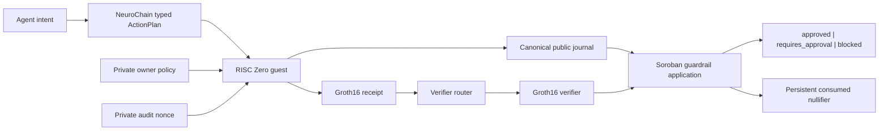
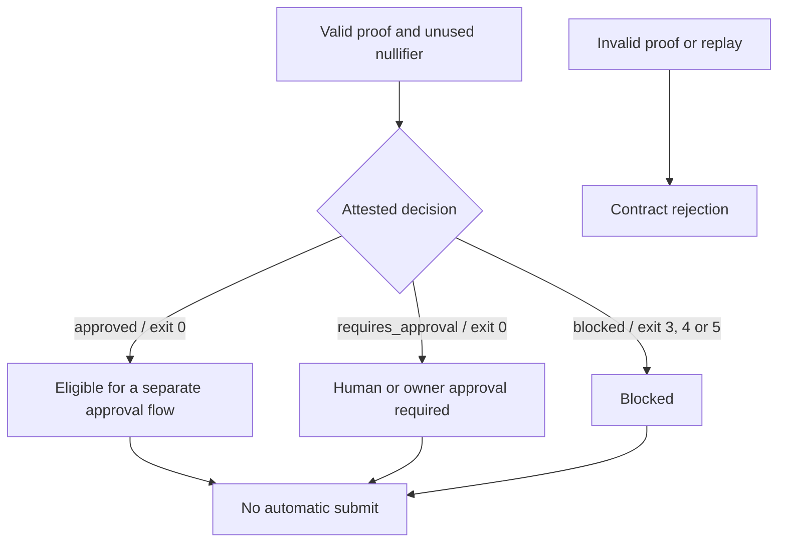

# Architecture

## Proof and verification flow

## Trust boundaries

### Private witness

The owner policy, commitment salt and audit nonce enter only the RISC Zero
guest. They are used to compute the policy commitment, decision and audit
nullifier but are not written to the public artifact.

### Committed evaluator

The RISC Zero image ID identifies the exact guest program. Soroban is
configured with that expected image ID and rejects a journal bound to another
evaluator.

### Public journal

The journal contains only commitments and the result. Canonical encoding and a
strict shared decoder prevent JSON formatting, key-order or parser ambiguity.

### Soroban verification

The application hashes the received journal, verifies the Groth16 seal through
the pinned router, checks the image binding, decodes the decision and consumes
the nullifier. Proof failure occurs before replay state is read or written.

## Decision boundary

Payment and proof verification are authorization inputs, not transaction
submission. Signing and broadcasting remain outside this hackathon package.
